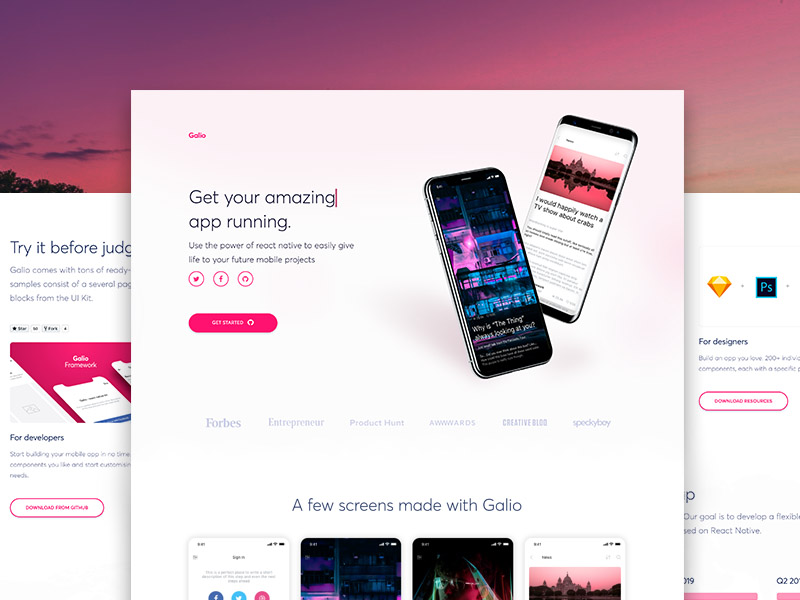

# [galio](https://www.galio.io) [](https://twitter.com/home?status=Galio,%20a%20free%20and%20beautiful%20UI%20framework%20https%3A//galio.io/%20%23reactnative%20%23react%20%23design%20%23developers%20%23freebie%20via%20%40galioframework)

[](https://github.com/galio-org/galio/issues)
[](https://github.com/galio-org/galio/issues?q=is%3Aissue+is%3Aclosed)
[](https://github.com/galio-org/galio/pulls)
[](https://github.com/galio-org/galio/pulls?q=is%3Apr+is%3Aclosed)
[](https://gitter.im/galio-community)
[](https://www.npmjs.com/package/galio-framework)
[](#backers) 
[](#sponsors) 



Galio is a 100% free and open source project, licensed under MIT License. You'll be building Android and iOS apps in style. Galio will always remain free to use and it is powered by a massive world-wide community.
It comes with a lot of carefully crafted, ready to be used components and a beautiful typography. Galio has a gorgeous base theme that adapts to each project. 
Built with real app examples, component demos, guides, and how-to's to get you up and running with mobile apps faster than ever before.

## Table of Contents
* [Quick start](#quick-start)
* [Components](#components)
* [Examples](#examples)
* [Documentation](#documentation)
* [Resources](#resources)
* [Reporting Issues](#reporting-issues)
* [Licensing](#licensing)
* [Useful Links](#useful-links)

## Quick Start

#### 1. Project Setup
```bash
git clone https://github.com/galio-org/galio.git
cd galio
npm install or yarn install
```

#### 2. Project testing
Terminal cli:
`npm run ios` or `yarn run ios`

User our iOS or Android app to directly view Expo projects on your phone.

[Expo iOS app](https://itunes.apple.com/us/app/expo-client/id982107779?mt=8)

[Expo Android app](https://play.google.com/store/apps/details?id=host.exp.exponent&hl=en)

#### 3. SDK library instructions
```bash
npm install galio-framework
```
or
```sh
yarn add galio-framework
```
Import UI components to new screens:
```js
import { Block, Button, Card, Icon, Input, NavBar, Text } from 'galio-framework';
```

## Components

Under Galio's belt:

:white_check_mark: NavBar

:white_check_mark: Block

:white_check_mark: Card

:white_check_mark: Button

:white_check_mark: Icon

:white_check_mark: Input

:white_check_mark: Text

:construction: Will follow: :construction:

TBA

## Examples

Here we will showcase some screens and some sample code of how we've used Galio in order to create them.


```js
renderCard = (props, index) => {
  const gradientColors = index % 2 ? GRADIENT_PINK : GRADIENT_BLUE;

  return (
    <Block row center card shadow space="between" style={styles.card} key={props.title}>
      <Gradient
        start={[0.45, 0.45]}
        end={[0.90, 0.90]}
        colors={gradientColors}
        style={[styles.gradient, styles.left]}
      >
        <Icon
          size={BASE_SIZE}
          name={props.icon}
          color={COLOR_WHITE}
          family={props.iconFamily}
        />
      </Gradient>

      <Block flex>
        <Text h5>{props.title}</Text>
        <Text muted>{props.subtitle}</Text>
      </Block>
      <Button style={styles.right}>
        <Icon size={BASE_SIZE * 1.5} name="ios-arrow-forward" family="Ionicons" color={COLOR_GREY} />
      </Button>
    </Block>
  );
}
```


```js
<Block flex space="between" center style={styles.absolute}>
  <NavBar transparent leftIconColor={theme.COLORS.WHITE} onLeftPress={() => props.navigation.openDrawer()} />
  <Block style={styles.articleSummary}>
    <Block row style={{ marginBottom: theme.SIZES.BASE }}>
      <Block row middle style={{ marginHorizontal: theme.SIZES.BASE }}>
        <Icon name="eye" family="MaterialCommunityIcons" color={theme.COLORS.WHITE} size={theme.SIZES.FONT * 0.8} />
        <Text p color={theme.COLORS.WHITE} style={{ marginLeft: theme.SIZES.BASE * 0.25 }}>25.2k</Text>
      </Block>
      <Block row middle>
        <Icon name="heart-outline" family="MaterialCommunityIcons" color={theme.COLORS.WHITE} size={theme.SIZES.FONT * 0.8} />
        <Text p color={theme.COLORS.WHITE} style={{ marginLeft: theme.SIZES.BASE * 0.25 }}>936</Text>
      </Block>
    </Block>
    {/*...more code in the open source files...*/}
  </Block>
</Block>
```


```js
<Block>
  <Input
    rounded
    type="email-address"
    placeholder="Email"
    autoCapitalize="none"
    style={{ width: width * 0.9 }}
    onChangeText={text => this.handleChange('email', text)}
  />
  <Input
    rounded
    password
    viewPass
    placeholder="Password"
    style={{ width: width * 0.9 }}
    onChangeText={text => this.handleChange('password', text)}
  />
  <Text
    color={theme.COLORS.ERROR}
    size={theme.SIZES.FONT * 0.75}
    onPress={() => Alert.alert('Not implemented')}
    style={{ alignSelf: 'flex-end', lineHeight: theme.SIZES.FONT * 2 }}
  >
    Forgot your password?
  </Text>
</Block>
```

## Documentation

The documentation for Galio is hosted at our [our website](https://galio.io/docs)

## Resources

* Website: <https://galio.io>
* Expo: <https://expo.io>
* Issues: [GitHub Issues Page](https://github.com/galio-org/galio/issues)


## Reporting Issues

We use GitHub Issues as the official bug tracker for Galio. Here are some advices for our users that want to report an issue:

1. Make sure that you are using the latest version of Galio. Check for your fork's master branch status and see if it's up to date with the upstream/master (our repository)
2. Provide us with reproductible steps for the issue.
3. Some issues may be platform specific, so specifying what platform and if it's a simulator or a hardware device will help a lot.

## Contributors

This project exists thanks to all the people who contribute. [[Contribute](CONTRIBUTING.md)].
<a href="https://github.com/galio-org/galio/contributors"></a>


## Backers

Thank you to all our backers! 🙏 [[Become a backer](https://opencollective.com/galio#backer)]

<a href="https://opencollective.com/galio#backers" target="_blank"></a>


## Sponsors

Support this project by becoming a sponsor. Your logo will show up here with a link to your website. [[Become a sponsor](https://opencollective.com/galio#sponsor)]

<a href="https://opencollective.com/galio/sponsor/0/website" target="_blank"></a>
<a href="https://opencollective.com/galio/sponsor/1/website" target="_blank"></a>
<a href="https://opencollective.com/galio/sponsor/2/website" target="_blank"></a>
<a href="https://opencollective.com/galio/sponsor/3/website" target="_blank"></a>
<a href="https://opencollective.com/galio/sponsor/4/website" target="_blank"></a>
<a href="https://opencollective.com/galio/sponsor/5/website" target="_blank"></a>
<a href="https://opencollective.com/galio/sponsor/6/website" target="_blank"></a>
<a href="https://opencollective.com/galio/sponsor/7/website" target="_blank"></a>
<a href="https://opencollective.com/galio/sponsor/8/website" target="_blank"></a>
<a href="https://opencollective.com/galio/sponsor/9/website" target="_blank"></a>

## Licensing

* Licensed under MIT (<https://github.com/galio-org/galio/blob/master/LICENSE>)

## Useful Links

Tutorials: coming soon...

Freebies from Galio Team: coming soon...

© 2018 [Galio](https://galio.io), made with love for apps.


